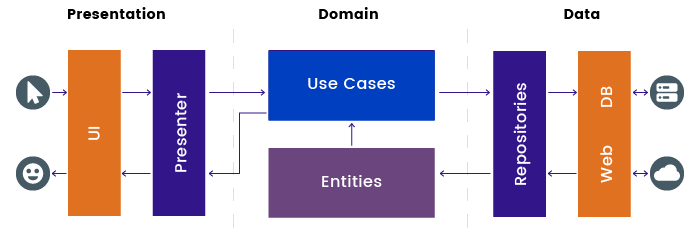

## Currency Converter
Currency conversion app using live exchange rates.

### API service
https://openexchangerates.org/

### Architecture
This app implements the MVVM architectural pattern using a single activity with jetpack compose and data-caching using a repository to fetch local or remote data. 



### Built with
MVVM, Coroutines, Flow, Retrofit, Room, Dagger-Hilt, Jetpack Compose

### License
```
 Copyright 2022 Altai Elistaev

   Licensed under the Apache License, Version 2.0 (the "License");
   you may not use this file except in compliance with the License.
   You may obtain a copy of the License at

     http://www.apache.org/licenses/LICENSE-2.0

   Unless required by applicable law or agreed to in writing, software
   distributed under the License is distributed on an "AS IS" BASIS,
   WITHOUT WARRANTIES OR CONDITIONS OF ANY KIND, either express or implied.
   See the License for the specific language governing permissions and
   limitations under the License.
